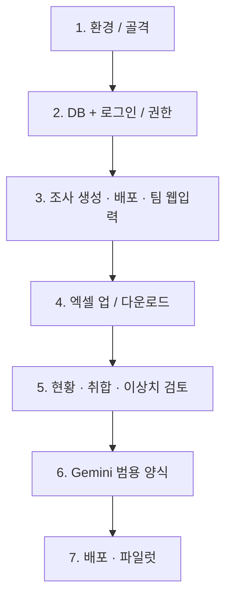

# 특근 인원 조사 취합 시스템 — 요구사항 명세서 (PoC)

## 0. 문서 개요

| 항목 | 내용 |
|---|---|
| 문서 목적 | Cursor AI를 활용한 PoC(개념검증) 구현을 위한 사전 요구사항 정의 |
| 대상 업무 | 특근 인원 조사 취합 업무 (공장 공무 담당) |
| 확장 목표 | 향후 임의의 취합 요청 데이터를 팀별로 배포·취합할 수 있는 범용 사이트로 발전 |
| 기술 스택 | Python, Streamlit, Google Gemini API |
| 문서 성격 | 개발 착수 전 "현재 업무 이해" 단계의 대화 내용을 바탕으로 작성된 요구사항 명세서 |

---

## 1. 배경 및 현재 업무 프로세스 (AS-IS)

- 대상 팀(6개): 구매팀, 제조팀, 생산관리팀, 품질보증팀, 생산기술파트, 자재파트
- 진행 주기: 매주 수요일 각 팀에 특근 인원 조사 양식(엑셀)을 배포 → 목요일 오전 11시까지 회신받아 취합
- 각 팀은 동일한 엑셀 양식에 팀명을 기입하여 이메일로 첨부 제출
- 담당자가 이를 수작업으로 취합하여 예상 특근 인원을 정리, 공장장에게 메일로 보고
- 특근 날짜는 토요일뿐 아니라 일요일도 있어 매번 유동적 — 특정 요일로 고정할 수 없음
- 원본 양식 파일(참고): `특근 인원 조사양식8월29~30일.xlsx` — 실제 기입본 기준 구조는 아래와 같다.

#### 현행 엑셀 양식 구조

- **한 시트 안에 특근일자가 여러 개**이면, 일자마다 표(헤더 + 인원 행 + 합계 행)가 **세로로 반복**된다. 날짜 컬럼을 가로로 늘리는 구조가 아니다.
- 제목(A1:G2 병합) 예: `용인공장 8/29 특근인원`
- 헤더는 **2행 구성**: 1행에 일자(`08/22(토요일)`), 바로 아래 행에 `근무시간` / `식수인원`이 붙는다.
- 팀명은 인원 행 전체에 **세로 병합**되고, 하단 `특근인원합계`·`식수인원` 합계(`=SUM(...)`) 행이 따라온다.
- 근무시간은 숫자만이 아니라 **`8H`처럼 숫자+단위 텍스트**로 기입된다.
- 비고는 단순 메모가 아니라 목적 구분에도 쓰인다 (예: `특근`, `AI 교육`).
- `NO`는 시트 전체가 아니라 **비고(목적) 그룹마다 1부터 다시 시작**하는 사례가 있다.
- 파일명·시트명·제목·일자 헤더가 서로 다를 수 있다 (예: 파일명 `8월29~30일`, 시트명 `0822`, 제목 `8/29`, 실제 블록 `08/22`·`08/30`). **일자는 반드시 표 헤더 셀에서 읽어야** 하며 파일명에 의존하면 안 된다.
- 헤더 라벨은 `직급 | 성명` 순서이나, 실무 기입본에서는 **C열=성명, D열=직급**으로 채워진 사례가 있다. 엑셀 업로드 파서는 이 불일치를 전제로 처리해야 한다.

```text
제목: 용인공장 8/29 특근인원

┌────┬────┬──────┬──────┬──────────────────┬──────┐
│ 팀 │ NO │ 직급 │ 성명 │ 08/22(토요일)    │ 비고 │
│    │    │      │      │ 근무시간 │ 식수인원 │      │
├────┼────┼──────┼──────┼─────────┼─────────┼──────┤
│제조팀│ 1 │ (성명)│ (직급)│   8H    │    1    │AI 교육│
│ (세로│ 2 │  ... │  ... │   8H    │    1    │ 특근 │
│  병합)│… │      │      │         │         │      │
├────┼────┼──────┼──────┼─────────┼─────────┼──────┤
│특근인원합계 │ 16 │      │ 식수인원 │         │ =SUM │      │
└────┴────┴──────┴──────┴─────────┴─────────┴──────┘

         ↓ 같은 시트 아래쪽에 다음 일자 블록 반복

┌────┬────┬──────┬──────┬──────────────────┬──────┐
│ 팀 │ NO │ 직급 │ 성명 │ 08/30(일요일)    │ 비고 │
│    │    │      │      │ 근무시간 │ 식수인원 │      │
└────┴────┴──────┴──────┴─────────┴─────────┴──────┘
```

### AS-IS의 문제점 (자동화 필요 이유)
- 팀별로 흩어진 이메일 첨부파일을 수작업으로 취합 → 반복적이고 시간 소모
- 매번 특근 날짜가 달라 양식/보고 형식을 매번 손으로 맞춰야 함
- 향후 본사 등에서 오는 "그때그때 다른 항목"의 취합 요청도 동일한 방식(양식 작성 → 팀별 배포 → 회수 → 취합)으로 처리되고 있어 확장성이 없음

---

## 2. 시스템 목표 (TO-BE)

1. 특근 인원 조사를 웹 기반으로 전환하여 이메일 첨부·수작업 취합 과정을 없앤다.
2. 팀 담당자는 웹에서 직접 입력하거나, 필요 시 기존처럼 엑셀 파일을 업로드하는 두 가지 방식을 모두 지원한다.
3. 담당자(관리자)는 실시간으로 제출 현황을 확인하고, 마감 후 자동 취합된 결과를 엑셀로 다운로드하여 검토 후 보고한다.
4. (확장) 향후 특근 인원 조사 외의 다른 취합 업무도 같은 구조로 처리할 수 있도록, Gemini API를 활용해 요청 내용으로부터 입력 양식을 자동 생성하는 기능을 추가한다.

---

## 3. 이해관계자 및 역할

| 역할 | 설명 | 권한 |
|---|---|---|
| 최고 관리자 (생산관리팀) | 조사 생성, 배포, 취합 결과 검토, 다운로드, 보고 | 전체 데이터 열람, 제출 현황 확인, 배포/마감 관리. 필요 시 생산관리팀 본인 인원도 입력 |
| 팀 담당자 | 제조팀, 구매팀, 품질보증팀, 생산기술파트, 자재파트 | 본인 팀 데이터만 입력/조회, 다른 팀 데이터 열람 불가 |
| 공장장 | 취합 결과 조회 | 조회 전용. 입력·배포·취합 실행 권한 없음. 메일 자동발송은 하지 않음 |

---

## 4. 기능 요구사항

### 4.1 인증 / 계정 관리
- 총 7개 계정으로 시작 (아이디/비밀번호는 `.streamlit/secrets.toml`에만 보관, 코드에 평문 저장 금지)

| 구분 | 아이디 | 역할 |
|---|---|---|
| 생산관리팀 | `prodadmin` | 최고 관리자 |
| 공장장 | `director` | 조회 전용 |
| 제조팀 | `jejo` | 팀 담당자 |
| 구매팀 | `gumae` | 팀 담당자 |
| 품질보증팀 | `quality` | 팀 담당자 |
| 생산기술파트 | `tech` | 팀 담당자 |
| 자재파트 | `jajae` | 팀 담당자 |

- 로그인한 기기에서 재접속 시 자동 로그인되는 기능 (쿠키/토큰 기반의 "로그인 상태 유지")
- 팀 계정은 로그인 후 본인 팀의 입력 화면만 접근 가능
- 생산관리팀(최고 관리자)은 전체 팀 현황, 취합, 다운로드 화면에 접근 가능
- 공장장은 취합 결과 조회만 가능
- 로그인한 사용자는 상단 **정보수정**에서 본인 비밀번호만 바꿀 수 있다. 변경분은 bcrypt 해시로 `data/yi_factory.db`에 저장되며, 초기 비밀번호는 `.streamlit/secrets.toml`에만 둔다
- 생산관리팀(최고 관리자)은 관리자메뉴에서 **다른 계정 비밀번호를 초기화**할 수 있다. 분실 시 현재 비밀번호 없이 새 비밀번호를 지정하며, 시스템은 메일을 보내지 않는다
- 신규 입사자는 **관리자메뉴**에서 해당 팀 담당자가 명부에 바로 추가한다. 최고 관리자가 전체 엑셀을 다시 올리지 않아도 된다

### 4.2 조사(설문) 생성 및 배포 — 관리자 화면
- 관리자가 이번 주 특근 조사를 새로 생성 (기본 항목: 조사 대상 기간/마감시각은 자동 또는 수동 설정 가능)
- 배포 직전 "배포하시겠습니까?" 확인 알림을 띄우고, 관리자가 확인해야만 팀에게 입력창이 열림 (**사람이 반드시 확인하는 단계 ①**)
- (확장 기능) 본사 등에서 온 요청 메일 본문/첨부파일 내용을 입력창에 붙여넣으면, Gemini API가 내용을 분석해 필요한 입력 항목(컬럼)을 제안하고 팀별 입력 양식을 자동 생성

### 4.3 팀별 인원 입력 — 팀 담당자 화면
- 상단 **특근인원**에서 달력을 보고, 특근이 있는 날(토요일 등)을 누른 뒤 오른쪽에서 입력
- 달력에는 **공장 전체 특근 인원**과 **식당 운영 여부**(20명 이상)가 표시되어 다른 팀도 확인할 수 있다. 이름 명단은 본인 팀만 보인다
- 생산관리팀(최고 관리자)도 특근인원·본사요청 취합자료에서 다른 팀과 같이 본인 팀 인원을 입력한다. 조사 배포·취합은 관리자메뉴에서 한다
- 입력 방식 두 가지 지원
  - (A) 웹 화면에서 직접 입력: 해당 팀 명부만 표시되고, 이름을 다시 적지 않으며 특근 여부·근무시간·식수인원·비고를 기입. 명부에 없는 일용직은 수기 추가
  - (B) 엑셀 파일 업로드: 기존 양식과 동일한 구조의 엑셀을 업로드하면 시스템이 자동으로 값을 읽어 저장 (인원이 많은 팀을 위한 대안)
- 입력/업로드는 마감 전까지 여러 번 수정 가능해야 함 (제출 후 재수정 허용 여부는 운영 중 결정)

### 4.4 실시간 제출 현황 확인 — 관리자 전용
- 6개 팀 중 어느 팀이 제출을 완료했는지 실시간으로 확인 가능한 화면
- 이 현황은 관리자만 볼 수 있으며, 팀 담당자는 다른 팀의 제출 여부를 볼 수 없음

### 4.5 자동 취합
- 마감(예: 목요일 오전 11시) 이후 또는 관리자가 "지금 취합" 버튼을 누르면, 6개 팀의 데이터를 하나의 표로 자동 통합
- 통합 시 "근무시간이 0(특근 미실시)인 인원은 자동으로 제외"
- 통합 결과에는 출처 팀 컬럼이 포함되어야 함
- 취합 직후 관리자가 결과를 검토하여 오류·이상치(예: 중복 인원, 값 누락 등)를 확인할 수 있는 화면 제공 (**사람이 반드시 확인하는 단계 ②**, 특히 초기 운영 단계에서 중요)

### 4.6 결과 다운로드 및 보고
- 취합된 최종 결과를 엑셀(.xlsx) 파일로 다운로드하는 기능
- 시스템이 메일을 자동 발송하지 않음 — 관리자가 다운로드한 파일을 직접 검토한 뒤 수동으로 메일을 작성해 공장장에게 발송 (**사람이 반드시 확인하는 단계 ③, 필수**)
- 모든 단계의 원본/중간/최종 데이터는 관리자가 언제든지 추출·재검토할 수 있어야 함

### 4.7 (확장 기능) 범용 취합 사이트
- 특근 인원 조사 외에, 본사 등에서 임의의 항목으로 취합을 요청하는 경우에도 동일한 구조(양식 생성 → 배포 → 팀별 입력 → 자동 취합 → 다운로드)로 처리 가능하도록 설계
- 최고 관리자는 관리자메뉴 **본사 요청 양식**에서 요청 메일 본문과 첨부(엑셀·워드·PDF·텍스트)를 올린다
- Gemini API 역할: 메일/첨부에서 팀별로 입력해야 할 항목(컬럼) 목록과 입력 양식(표 구조)을 제안
- AI가 생성한 양식은 반드시 관리자가 배포 전 확인 절차(4.2)를 거쳐야 함 — AI 결과를 그대로 자동 배포하지 않음
- 배포된 양식은 각 팀의 **본사요청 취합자료** 메뉴에서 기입

---

## 5. 비기능 요구사항

| 구분 | 요구사항 |
|---|---|
| 보안 | Gemini API Key는 `st.secrets`로 관리하며 코드에 하드코딩하지 않음. GitHub 등 외부 저장소에 API Key, 계정 정보가 업로드되지 않도록 `.gitignore` 설정 |
| 계정 보안 | 팀별 계정 비밀번호는 해시(암호화)하여 저장 (평문 저장 금지) |
| 데이터 보존 | 매주 취합 데이터는 누적 저장하여 이후에도 조회 가능하도록 함 |
| 사용성 | 비개발자(팀 담당자)도 별도 교육 없이 사용할 수 있는 단순한 화면 구성 |
| 이식성 | PC뿐 아니라 필요 시 모바일 브라우저에서도 입력 가능하면 좋음 (필수 요구사항은 아님) |

---

## 6. 데이터 항목 정의

| 컬럼명 | 설명 | 비고 |
|---|---|---|
| 팀 | 6개 팀 중 하나 (로그인 계정으로 자동 결정) | 자동 입력. 현행 양식에서는 인원 행 세로 병합 |
| 회사 | 에이텍모빌리티 / 에이텍컴퓨터 | 명부에서 가져오거나, 일용직 수기 시 선택 |
| 고용형태 | 정규직 / 계약직 / 일용직 | 명부 기준. 수기 추가는 일용직 |
| NO | 순번 | 자동 부여 가능. 현행 양식은 비고 그룹별로 1부터 재시작되는 사례 있음 |
| 직급 | 예: 수석 / 책임 / 선임 / 사원 | 엑셀 구양식 호환용. 웹 명부 입력에서는 사용하지 않음 |
| 성명 | 특근 인원 이름 | 필수. 웹에서는 명부에서 가져와 수정하지 않음 |
| 특근일자 | 팀이 자유롭게 지정 (토/일 등) | 필수. 현행 양식은 컬럼명이 아니라 **일자별 표 블록의 헤더**(`08/22(토요일)` 형식) |
| 근무시간 | 숫자(시간) | 취합 시 0은 제외. 현행 양식 기입값은 `8H` 등 텍스트 → 내부 저장 시 숫자 변환 |
| 식수인원 | 숫자 | 선택. 현행 양식은 인원당 1인 경우가 많고, 합계 행에 `=SUM` 사용 |
| 비고 | 자유 텍스트 | 선택. 실무에서는 `특근`, `AI 교육`처럼 목적 구분에도 사용 |
| 수기 | 명부에 없는 일용직을 팀이 직접 추가했는지 | 시스템 구분. 자주 바뀌는 일용직용 |
| 출처팀(통합 시 자동 추가) | 취합본에서 어느 팀 데이터인지 구분 | 시스템 자동 생성 |

---

## 7. 화면 구성 개요 (Streamlit 기준)

상단 메뉴: **특근인원** · **본사요청 취합자료** · **관리자메뉴** · **정보수정** · **로그아웃** (공장장은 관리자메뉴가 없음)

1. **로그인 화면**: 계정/비밀번호 입력, "로그인 상태 유지" 체크박스
2. **특근인원 (달력)**: 왼쪽 월 달력에서 날짜를 누르면 오른쪽에 해당일 명단. 칸마다 공장 전체 특근 인원·식당 운영(20명 이상) 표시. 팀 담당자(생산관리팀 포함)는 명부에서 특근 체크 + 일용직 수기. 공장장은 조회만
3. **본사요청 취합자료**: 관리자가 배포한 본사 요청 양식에 팀별 입력. 공장장은 조회만
4. **관리자메뉴**: 팀 담당자는 본인 팀 명부 추가/삭제. 최고 관리자는 본사 메일·첨부 → Gemini 양식 제안 → 조사 생성·배포, 제출 현황·취합, 명부 엑셀, 계정
5. **정보수정**: 본인 비밀번호 변경
6. **공장장**: 달력에서 취합된 특근 인원(0시간 제외) 조회. 제출 현황·원본 입력·다운로드·배포 불가

---

## 8. 사람이 직접 확인·판단해야 하는 단계 (요약)

| 단계 | 시점 | 필요성 |
|---|---|---|
| ① 배포 전 확인 | 양식 배포 직전 | 간단한 확인 알림("배포하시겠습니까?")으로 오배포 방지 |
| ② 취합 전/후 검토 | 자동 취합 직후 | 특히 초기 운영 단계에서 데이터 오류 여부 확인 |
| ③ 발송 전 최종 검토 | 엑셀 다운로드 후 메일 발송 전 | 반드시 담당자 본인이 검토·판단 (시스템 자동발송 없음) |

---

## 9. 기술 제약 사항 (필수 준수)

- 전체 로직은 Python으로 구현
- React, Vue, Next.js 등 프론트엔드 프레임워크 사용 금지
- 화면(웹 UI)은 Streamlit으로 구현
- AI 기능은 Google Gemini API를 통해 구현 (별도 ML 모델 학습 없음)
- Gemini API Key는 `st.secrets`에 저장, GitHub 등에 노출되지 않도록 처리

---

## 10. 구현 적합 기술 방식 추천 및 이유

| 영역 | 추천 기술 | 추천 이유 |
|---|---|---|
| 웹 UI | **Streamlit** | Python만으로 로그인, 표 입력, 파일 업로드, 다운로드 버튼까지 구현 가능해 프론트엔드 지식 없이도 빠른 PoC 제작에 적합. 지시된 기술 제약과도 일치 |
| 데이터 저장 | **SQLite** (파일 기반 DB) | 별도 서버 설치 없이 파일 하나로 동작하여 PoC 단계에 적합하고, 이후 필요 시 다른 DB로 손쉽게 전환 가능. Python 표준 라이브러리(`sqlite3`)로 바로 사용 가능 |
| 계정 인증 | **`streamlit-authenticator`** 라이브러리 | 비밀번호 해시 저장, 로그인 유지(쿠키) 기능을 자체 구현 없이 제공하여 보안·개발 속도 모두 확보 |
| 엑셀 입출력 | **`openpyxl` / `pandas`** | 팀별 업로드 엑셀 읽기, 취합 결과 엑셀 생성·다운로드에 표준적으로 쓰이는 조합으로 안정적이고 자료가 많음 |
| AI 양식 생성(확장 기능) | **Google Gemini API (`google-generativeai` 패키지)** | 요청 메일/첨부 텍스트를 분석해 구조화된 항목 목록(JSON)을 뽑아내는 용도로 적합하며, 사용자가 지정한 기술 요구사항과 일치 |
| API Key 관리 | **`st.secrets` (`.streamlit/secrets.toml`)** | Streamlit 표준 방식으로 코드와 키를 분리하고, `.gitignore`로 GitHub 업로드를 방지하기 쉬움 |
| 배포 환경 | **Streamlit Community Cloud 또는 사내 서버** | 별도 인프라 구축 없이 빠르게 팀원들이 접속 가능한 URL 제공 (사내 보안 정책에 따라 사내 서버 선택 가능) |

---

## 11. 개발 시작 전 준비물 및 설치 방법

| 준비물 | 용도 | 준비/설치 방법 |
|---|---|---|
| Python 3.10 이상 | 전체 개발 환경 | [python.org](https://www.python.org/downloads/)에서 설치 파일 다운로드 후 설치 |
| Cursor AI (또는 VS Code) | 코드 작성/편집 | [cursor.sh](https://www.cursor.com/)에서 다운로드 후 설치 |
| 가상환경 | 패키지 충돌 방지 | 터미널에서 `python -m venv venv` 실행 후 `venv\Scripts\activate`(Windows) 또는 `source venv/bin/activate`(Mac) 로 활성화 |
| Streamlit | 웹 UI 프레임워크 | 가상환경 활성화 후 `pip install streamlit` |
| pandas, openpyxl | 엑셀 처리 | `pip install pandas openpyxl` |
| streamlit-authenticator | 로그인/계정 관리 | `pip install streamlit-authenticator` |
| google-generativeai | Gemini API 호출 | `pip install google-generativeai` |
| Google AI Studio 계정 및 API Key | Gemini API 사용 | [aistudio.google.com](https://aistudio.google.com/)에서 구글 계정으로 로그인 후 "Get API Key" 메뉴에서 발급 |
| `.streamlit/secrets.toml` 파일 | API Key 등 민감정보 보관 | 프로젝트 폴더에 `.streamlit` 폴더 생성 → 그 안에 `secrets.toml` 파일 생성 → `GEMINI_API_KEY = "발급받은키"` 형식으로 작성 |
| `.gitignore` 파일 | GitHub 업로드 방지 | 프로젝트 최상위에 `.gitignore` 파일 생성 후 `.streamlit/secrets.toml`, `venv/`, `*.db` 등을 목록에 추가 |
| GitHub 계정 및 저장소(선택) | 배포/버전관리 | [github.com](https://github.com)에서 계정 생성 후 새 저장소(Repository) 생성 (API Key가 포함된 파일은 위 `.gitignore`로 반드시 제외) |

---

## 12. 개발 구현 단계

> 특근 인원 조사 취합 **PoC(1~5단계)** 를 먼저 완성하고, 안정화 후에 **범용 취합 + Gemini(6단계)** 와 **배포(7단계)** 로 확장한다.  
> 엑셀 입출력(4단계)은 현행 양식 `특근 인원 조사양식8월29~30일.xlsx` 구조를 기준으로 한다.

### 전체 방향

| 구분 | 범위 | 목표 |
|---|---|---|
| **PoC (1~5단계)** | 특근 인원 조사만 | 이메일 첨부·수작업 취합을 웹으로 대체 |
| **확장 (6단계)** | 임의의 취합 요청 | Gemini로 입력 양식 자동 생성 |
| **배포 (7단계)** | 6개 팀 실사용 | URL로 접속 가능한 상태 |

기술 제약은 [9. 기술 제약 사항](#9-기술-제약-사항-필수-준수)과 동일하다. Python + Streamlit, SQLite, `streamlit-authenticator`, pandas/openpyxl, Gemini API(`st.secrets`). React / Vue / Next.js는 사용하지 않는다.



```text
1. 환경/골격
   → 2. DB + 로그인/권한
      → 3. 조사 생성·배포·팀 웹입력     ← 여기까지 내부 데모 가능
         → 4. 엑셀 업/다운로드          ← 현행 양식 호환
            → 5. 현황·취합·이상치 검토  ← PoC 완료 (실무 대체 가능)
               → 6. Gemini 범용 양식    ← 확장
                  → 7. 배포·파일럿
```

구현 중에도 빼면 안 되는 **사람 확인 지점** ([8절](#8-사람이-직접-확인판단해야-하는-단계-요약)):

1. **배포 직전 확인** — "배포하시겠습니까?"
2. **취합 직후 검토** — 이상치·누락 확인
3. **엑셀 다운로드 후 메일 수동 발송** — 시스템 자동 발송 없음

---

### 1단계 — 개발 환경·프로젝트 골격

[11. 개발 시작 전 준비물](#11-개발-시작-전-준비물-및-설치-방법)을 먼저 맞춘다.

- [x] Python 3.10+, 가상환경, `requirements.txt`
- [x] `streamlit` / `pandas` / `openpyxl` / `streamlit-authenticator` / `google-generativeai` 설치
- [x] `.gitignore`에 `.streamlit/secrets.toml`, `venv/`, `*.db` 추가
- [x] `.streamlit/secrets.toml`에 Gemini Key 자리만 확보 (코드에 키를 넣지 않음)
- [x] 폴더 구조 분리: 로그인 / 팀 화면 / 관리자 / 공장장 / DB / 엑셀 처리 모듈
- [x] 7개 계정 발급 (생산관리팀=최고 관리자, 공장장=조회, 5개 팀 담당자)

**산출물:** `streamlit run app.py`로 로그인 후 역할별 화면으로 분기.

---

### 2단계 — 데이터 모델·계정

화면보다 **저장 구조**를 먼저 잡는다. 매주 데이터가 누적되어야 하므로 SQLite를 사용한다.

| 테이블 | 역할 |
|---|---|
| `users` | 7개 계정(최고 관리자 1 + 공장장 1 + 팀 5). 비밀번호는 secrets.toml에서 해시 |
| `surveys` | 조사 건(대상 기간, 마감시각, 배포 여부) |
| `employees` | 임직원 명부(성명, 회사, 팀, 고용형태). 엑셀 전체 갱신 + 팀 담당자 개별 추가 |
| `entries` | 팀별 특근 인원 행(회사, 고용형태, 수기 여부 포함) |
| `submissions` | 팀별 제출 상태(완료/미완료, 최종 제출 시각) |

계정 규칙:

- 팀 계정은 본인 팀 데이터만 입력/조회
- 관리자는 전체 열람·배포·취합
- 로그인은 `streamlit-authenticator` + "로그인 상태 유지"
- 공장장은 배포된 조사 목록만 조회하고, 원본 입력·제출 현황은 열람하지 않음

현행 양식과의 매핑:

| DB 컬럼 | 현행 엑셀에서의 위치 |
|---|---|
| `team` | A열 세로 병합 셀 (로그인 계정으로 덮어쓰는 것이 안전) |
| `seq_no` | B열 `NO` (목적 그룹별 재시작 가능 → 단순 PK로 쓰지 않음) |
| `name` / `rank` | C·D열. **헤더와 실기입 순서가 반대인 사례**를 파서에서 처리 |
| `work_date` | 블록 헤더 (`08/22(토요일)`). 행 값이 아님 |
| `work_hours` | `8H` → 내부 `8` (숫자). 취합 시 `0` 제외 |
| `meal_count` | 식수인원 |
| `note` | 비고 (`특근`, `AI 교육` 등) |

- [x] `users` / `surveys` / `entries` / `submissions` 테이블 생성 (기존 비밀번호 해시 유지)
- [x] `employees` 명부·`entries`의 회사/고용형태/수기 컬럼은 4단계에서 추가
- [x] 계정 역할·소속 팀을 DB에 저장
- [x] 팀 계정은 본인 팀 `entries`만 읽기/쓰기, 관리자는 전체, 공장장은 원본 입력 열람 불가
- [x] 근무시간 `8H` → 숫자 `8` 변환
- [x] 관리자 화면에 DB 계정 현황·조사 건수 표시

**산출물:** 로그인 후 역할에 따라 다른 화면으로 분기하고, 조사 데이터는 SQLite에 누적 저장할 수 있다.

---

### 3단계 — 핵심 업무 흐름 (PoC 본체)

문서 [4.2](#42-조사설문-생성-및-배포--관리자-화면)~[4.3](#43-팀별-인원-입력--팀-담당자-화면), [화면 1~3](#7-화면-구성-개요-streamlit-기준)에 해당한다. **여기까지가 최소 동작 PoC**이다.

**관리자**

1. 이번 주 조사 생성 (기간·마감시각 자동/수동)
2. 배포 전 확인 알림 — "배포하시겠습니까?" (**사람 확인 ①**)
3. 확인 후에만 팀 입력창 개방

**팀 담당자 (웹 직접 입력)**

- 특근일자를 팀이 자유롭게 지정 (토/일 고정 금지). 현행 양식처럼 **일자 = 별도 블록**.
- 관리자가 올린 임직원 명부 중 **본인 팀 인원만** 보이고, 이름은 적지 않으며 특근 여부·근무시간·식수·비고만 기입
- 명부에 없는 일용직은 팀이 수기로 추가 (고용형태는 일용직, 회사는 에이텍모빌리티/에이텍컴퓨터 선택)
- 팀명·NO는 시스템이 채움
- 행 추가/삭제, 마감 전까지 수정 가능 (재제출 허용 여부는 운영으로 확정)

**산출물:** 관리자가 배포하면 6개 팀이 각자 입력·저장할 수 있음.

- [x] 관리자 조사 생성 (기간·마감 기본값 + 수동 수정)
- [x] 배포 전 "배포하시겠습니까?" 확인 후에만 팀 입력창 개방
- [x] 팀 웹 입력: 일자 블록 추가, 직급/성명/근무시간/식수/비고, 행 추가·삭제
- [x] 팀명·NO 자동, 마감 전 저장·제출·재수정, 마감 후 팀 수정 불가

---

### 4단계 — 엑셀 업로드·다운로드

문서 [4.3(B)](#43-팀별-인원-입력--팀-담당자-화면), [4.6](#46-결과-다운로드-및-보고)에 해당한다. **현행 양식과 왕복 호환**이 이 단계의 핵심이다. 웹 입력은 매번 이름을 적지 않고, 관리자가 올린 임직원 명부에서 팀 인원만 골라 특근 여부를 표시한다.

용인공장에는 **에이텍모빌리티**와 **에이텍컴퓨터**가 같이 근무한다. 명부 컬럼은 **성명 / 회사 / 팀 / 고용형태(정규직·계약직·일용직)** 이다. 일용직은 자주 바뀌므로 매번 전체 목록을 올리지 않고, 팀은 화면에서 수기로 추가한다. 고정 일용직만 명부에 넣어 두면 해당 팀 화면에 함께 나타난다.

**임직원 명부 (관리자)**

- [x] 명부 양식 다운로드, 엑셀 업로드 시 기존 명부 전체 교체 (확인 체크 후 반영)
- [x] 회사·팀·고용형태 값 정규화, 팀 계정은 본인 팀 명부만 조회

**웹 입력**

- [x] 팀 화면에는 해당 팀 명부만 표시. 성명·회사·고용형태는 수정 불가, 특근 체크·근무시간·식수·비고만 기입
- [x] 명부에 없는 일용직 수기 행 추가 (회사 선택, 고용형태는 일용직)

**업로드 파서 (현행 양식 기준)**

- [x] 시트 전체를 위에서 아래로 스캔해 **일자 블록**을 여러 개 인식한다 (헤더행 `팀/NO/직급/성명` + 일자 병합셀).
- [x] 일자는 파일명·시트명이 아니라 **헤더의 일자 셀**에서 읽는다.
- [x] `특근인원합계` 행, 빈 행, 제목 행은 인원 데이터에서 제외한다.
- [x] 근무시간 `8H` → 숫자 `8`로 정규화한다. 숫자만 있는 값도 허용한다.
- [x] C/D열은 헤더 라벨만 믿지 않는다. 직급 사전(수석/책임/선임/사원 등)으로 열을 판별하거나, 실무 기입 순서(C=성명, D=직급)를 명시적으로 지원한다.
- [x] 팀명은 로그인 계정 팀을 우선하고, 파일의 팀명과 다르면 경고한다.
- [x] 엑셀에서 읽은 이름은 명부와 대조해 회사·고용형태를 채우고, 없으면 수기 일용직으로 저장한다.

**다운로드**

- [x] 팀 입력분·관리자 전체 팀 원본 `.xlsx` 생성. 출처팀은 A열(팀)
- [x] 현행 양식과 비슷한 형태(일자별 블록 + 합계 행)
- [x] 원본 데이터를 관리자가 언제든 다시 받을 수 있게 함
- [x] 메일은 보내지 않음. 담당자가 파일을 받아 검토 후 수동 발송 (**사람 확인 ③**)

**산출물:** 웹 입력과 엑셀 업로드가 같은 `entries`로 모이고, 결과는 엑셀로 나간다.

---

### 5단계 — 제출 현황·자동 취합·검토

문서 [4.4](#44-실시간-제출-현황-확인--관리자-전용)~[4.5](#45-자동-취합), 사람 확인 ②에 해당한다. 수작업 취합을 없애는 단계이다.

- [x] 관리자만 보는 팀별 제출 현황 (완료/미완료)
- [x] 마감 시각 이후, 또는 "지금 취합" 버튼으로 6개 팀 통합
- [x] 근무시간 0인 인원 자동 제외 (`8H`는 8로 간주, 빈값/0/`0H`는 제외)
- [x] 통합표에 출처팀 컬럼 추가
- [x] 이상치 표시: 중복 성명(같은 일자), 필수값 누락, 비정상 근무시간, 팀명 불일치
- [x] 일자별 특근인원·식수인원 합계를 현행 양식의 합계 행과 같은 의미로 계산
- [x] 관리자가 표를 본 뒤에만 다운로드하는 흐름을 기본으로 함

**산출물:** **특근 조사 PoC 완료.** AS-IS(수요일 배포 → 목요일 취합 → 공장장 보고)를 웹으로 한 바퀴 돌릴 수 있다.

---

### 6단계 — 범용 취합 + Gemini (확장)

문서 [2-4항](#2-시스템-목표-to-be), [4.2 확장](#42-조사설문-생성-및-배포--관리자-화면), [4.7](#47-확장-기능-범용-취합-사이트), [화면 5](#7-화면-구성-개요-streamlit-기준)에 해당한다. **PoC가 안정된 뒤에만** 넣는다.

- [x] 조사 스키마를 "특근 고정 컬럼"이 아니라 "조사마다 다른 컬럼 목록"으로 일반화
- [x] 요청 메일/첨부 텍스트 붙여넣기 → Gemini가 컬럼·표 구조 JSON 제안
- [x] 미리보기 후 관리자 확인·배포 (AI 결과 자동 배포 금지)
- [x] API Key는 `st.secrets`만 사용

**산출물:** 특근 조사와 동일한 흐름(생성 → 배포 → 입력 → 취합 → 다운로드)으로 다른 취합도 처리.

---

### 7단계 — 배포·실사용 점검

- [x] 사내 서버 실행 설정 (`run.bat`, `.streamlit/config.toml`, 데이터 폴더 `YI_FACTORY_DATA_DIR`)
- [x] 7개 계정 발급 (앱 계정은 준비됨. 비밀번호는 secrets.toml / Cloud Secrets에만 두고 담당자에게 직접 전달)
- [x] 모바일: 사이드바를 접어 입력 칸을 넓힘. 휴대폰 브라우저에서도 로그인·입력 가능 (필수 확인은 아님)
- [x] 비개발자 기준으로 버튼·안내 문구 단순화
- [x] 달력형 특근 입력, 상단 메뉴(특근인원 / 본사요청 취합자료 / 관리자메뉴 / 정보수정 / 로그아웃)
- [x] 팀 담당자가 관리자메뉴에서 신규 입사자 명부 추가 (최고 관리자 엑셀 재업로드 없이)
- [x] 1~2주 파일럿 체크리스트: 수요일 배포 → 목요일 취합을 현행 엑셀과 병행해 인원 수·식수·일자별 명단을 대조

**사내 서버**

1. 프로젝트 폴더에서 `run.bat` 실행 (또는 `streamlit run app.py --server.address 0.0.0.0 --server.port 8501`)
2. `.streamlit/secrets.toml`에 7개 계정 비밀번호와 `cookie_key`를 넣는다. Git에 올리지 않는다.
3. 데이터가 남는 디스크를 쓰려면 환경 변수 `YI_FACTORY_DATA_DIR`에 폴더 경로를 지정한다.
4. 팀 PC/휴대폰에서 `http://서버주소:8501` 로 접속한다.

**Streamlit Community Cloud**

- 저장소에 `secrets.toml`을 올리지 말고, Cloud 대시보드 Secrets에 같은 항목을 넣는다.
- Community Cloud는 재시작 시 로컬 파일이 지워질 수 있어, **실사용은 사내 서버를 권장**한다. 데모용으로만 Cloud를 쓴다.
- 관리자 계정 탭에서 저장 파일을 주기적으로 받아 둔다.

**파일럿 대조**

같은 주 특근을 웹과 기존 엑셀로 같이 돌린 뒤 아래를 맞춘다.

- [ ] 일자별 특근 인원 수가 같다
- [ ] 일자별 식수 합계가 같다
- [ ] 일자별 명단(이름)이 같다
- [ ] 0시간 인원은 취합본에 없다
- [ ] 메일은 웹이 보내지 않고, 담당자가 엑셀을 보고 직접 보낸다

**산출물:** 6개 팀이 URL로 접속해 실무 주기를 돌릴 수 있는 상태.

---

*본 문서는 대화를 통해 파악한 업무 내용을 바탕으로 작성된 초안이며, 실제 개발 진행 중 세부 화면 설계·데이터베이스 스키마·에러 처리 방식 등은 추가 협의를 통해 구체화될 수 있습니다.*
